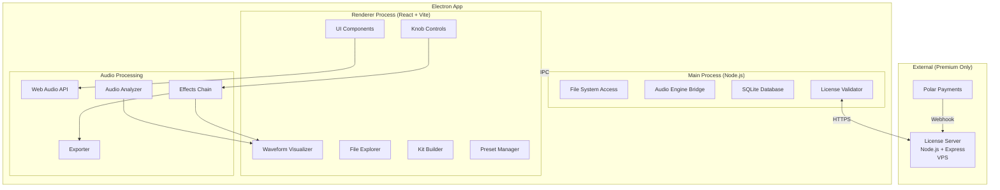

# PRD — SampleMint

## 1. Overview

### Product Summary

**SampleMint** — "SampleMint lets producers analyze any sound and create original, copyrightable one-shots and drum kits they can sell — no AI copyright headaches."

SampleMint is a cross-platform desktop sound design workstation built with Electron. Producers load a reference audio file or start from an ultra-realistic preset, then use knob-based controls to shape the sound with effects (reverb, echo, pitch, distortion, filter). The real-time waveform visualization shows exactly what the sound looks like. An A/B comparison feature lets producers verify their creation is distinct from the original. The kit builder assembles individual one-shots into packaged drum kits ready for commercial sale. Everything runs locally — no internet required for core functionality.

### Objective

This PRD covers the SampleMint MVP as defined in product-vision.md § Product Strategy § MVP Definition. The scope is: audio file analysis (single file), preset library (core instruments), knob-based effects, real-time waveform visualization, realistic vs. EDM mode toggle, A/B comparison, export to WAV/MP3, built-in file explorer, kit builder workspace, and the Electron cross-platform shell.

### Market Differentiation

The technical implementation must deliver three things that no competitor offers in combination: (1) an audio analysis pipeline that extracts meaningful characteristics from reference files and uses them as a starting point for synthesis, (2) real-time effects processing with visual waveform feedback that feels instant, and (3) an A/B comparison system that provides side-by-side audible and visual proof of originality. The integrated pipeline — from file input to kit export — must be seamless enough that a producer never needs to leave the app.

### Magic Moment

The magic moment is: load a sound → analyze → tweak knobs → A/B compare → export. For this to work technically: file analysis must complete in under 3 seconds, knob adjustments must produce audible changes with under 10ms latency, A/B toggle must be instant (no buffering), and export must complete in under 2 seconds. The waveform must update in real time during knob adjustments — any visible lag breaks the illusion of direct control.

### Success Criteria

- Time from first app launch to first export: under 5 minutes
- Audio file analysis: under 3 seconds for files up to 10MB
- Knob-to-audio latency: under 10ms (perceived real-time)
- Waveform render update: 60fps during knob adjustment
- Export to WAV: under 2 seconds for a single one-shot
- App launch time: under 3 seconds on a mid-range machine
- All P0 features functional with manual verification
- Cross-platform: installs and runs on macOS, Windows, and Linux
- Bundle size: under 200MB installed

---

## 2. Technical Architecture

### Architecture Overview



### Chosen Stack

| Layer | Choice | Rationale |
|-------|--------|-----------|
| Frontend | React + Vite | Largest ecosystem, excellent audio visualization libraries (Wavesurfer.js, Web Audio API), pairs perfectly with Electron |
| Desktop Shell | Electron | Cross-platform (macOS, Windows, Linux) from a single codebase, native file system access, mature ecosystem |
| Backend | None (local-first) + Node.js/Express license server | All audio processing on-device. License server on VPS for key validation only |
| Database | SQLite via better-sqlite3 | Local storage for presets, kit metadata, user settings. Zero cost, works offline |
| Auth | Serial key licensing with hardware fingerprinting | Industry-standard for audio tools. No user sign-in. Hardware-bound activation |
| Payments | Polar | Built for digital products, global tax handling, integrates with license key delivery |

### Stack Integration Guide

**Setup order:**

1. Initialize the project with Vite + React template
2. Add Electron using electron-builder for packaging
3. Configure the Electron main process with IPC handlers for file system access
4. Set up better-sqlite3 in the main process (native module — requires electron-rebuild)
5. Install and configure Tailwind CSS with design tokens from product-vision.md
6. Set up the Web Audio API context in the renderer process
7. Add wavesurfer.js for waveform visualization
8. Configure electron-builder for multi-platform builds

**Key integration patterns:**

- **Electron IPC:** The renderer (React) communicates with the main process (Node.js) via `ipcMain`/`ipcRenderer` for file system operations, database queries, and license validation. Audio processing stays in the renderer using the Web Audio API for minimum latency.
- **Native modules:** better-sqlite3 is a native Node.js module. It requires `electron-rebuild` after installation. Configure electron-builder's `afterInstall` hook to run rebuild automatically.
- **Web Audio API in Electron:** Electron's Chromium renderer supports the full Web Audio API. The `AudioContext` is created in the renderer process. All audio nodes (gain, biquad filter, convolver for reverb, delay) are connected in a processing chain.
- **File system access:** Use Node.js `fs` module in the main process, exposed to the renderer via IPC. Never use `nodeIntegration: true` — always use `contextBridge` and `preload` scripts for security.

**Common gotchas:**

- better-sqlite3 must be rebuilt for the specific Electron version. Pin the electron-rebuild version that matches your Electron version.
- Web Audio API's `AudioContext` requires user interaction to start on some platforms. Initialize on first user click.
- Electron's `dialog.showOpenDialog` is the proper way to open file pickers — don't use HTML file inputs.
- On macOS, app signing is required for distribution. Set up code signing early.
- On Linux, AppImage is the most portable format. Include it in electron-builder config.

**Required environment variables:**

```
# License server (production only)
LICENSE_SERVER_URL=https://api.samplemint.com
LICENSE_SERVER_API_KEY=<server-to-server key>

# Polar (license server environment)
POLAR_WEBHOOK_SECRET=<from Polar dashboard>
POLAR_API_KEY=<from Polar dashboard>

# App (embedded in build)
VITE_APP_VERSION=<from package.json>
VITE_LICENSE_SERVER_URL=https://api.samplemint.com
```

### Repository Structure

```
samplemint/
├── electron/
│   ├── main.ts                    # Electron main process entry
│   ├── preload.ts                 # Context bridge for renderer
│   ├── ipc/
│   │   ├── file-system.ts         # File system IPC handlers
│   │   ├── database.ts            # SQLite IPC handlers
│   │   └── license.ts             # License validation IPC handlers
│   └── utils/
│       ├── hardware-fingerprint.ts # CPU, MAC address, OS info collection
│       └── paths.ts               # App data directory paths
├── src/
│   ├── main.tsx                   # React entry point
│   ├── App.tsx                    # Root component with layout
│   ├── components/
│   │   ├── ui/                    # Design system primitives
│   │   │   ├── Button.tsx
│   │   │   ├── Knob.tsx           # Rotary knob control
│   │   │   ├── Toggle.tsx
│   │   │   ├── Panel.tsx
│   │   │   ├── Modal.tsx
│   │   │   └── Tooltip.tsx
│   │   └── features/
│   │       ├── waveform/
│   │       │   ├── WaveformDisplay.tsx
│   │       │   └── ABComparison.tsx
│   │       ├── effects/
│   │       │   ├── EffectsRack.tsx
│   │       │   └── KnobControl.tsx
│   │       ├── file-explorer/
│   │       │   ├── FileExplorer.tsx
│   │       │   └── FileTree.tsx
│   │       ├── preset-library/
│   │       │   ├── PresetBrowser.tsx
│   │       │   └── PresetCard.tsx
│   │       ├── kit-builder/
│   │       │   ├── KitBuilder.tsx
│   │       │   ├── KitSlot.tsx
│   │       │   └── KitExporter.tsx
│   │       └── licensing/
│   │           └── ActivationDialog.tsx
│   ├── audio/
│   │   ├── engine.ts              # Audio engine singleton (AudioContext, master chain)
│   │   ├── analyzer.ts            # Audio file analysis (FFT, spectral analysis)
│   │   ├── effects/
│   │   │   ├── reverb.ts          # Convolver-based reverb
│   │   │   ├── delay.ts           # Echo/delay effect
│   │   │   ├── pitch.ts           # Pitch shifting
│   │   │   ├── distortion.ts      # Distortion/drive
│   │   │   └── filter.ts          # Low-pass/high-pass filter
│   │   ├── synthesizer.ts         # Sound synthesis from analysis data
│   │   ├── presets.ts             # Preset loading and management
│   │   ├── exporter.ts            # WAV/MP3 export
│   │   └── modes.ts               # Realistic vs EDM mode parameters
│   ├── store/
│   │   ├── audio-store.ts         # Audio state (current sound, effects values)
│   │   ├── ui-store.ts            # UI state (panels, views)
│   │   ├── kit-store.ts           # Kit builder state
│   │   └── preset-store.ts        # Preset library state
│   ├── lib/
│   │   ├── database.ts            # SQLite query helpers (via IPC)
│   │   ├── file-utils.ts          # File path and format helpers
│   │   └── constants.ts           # App-wide constants
│   ├── hooks/
│   │   ├── useAudioEngine.ts      # Audio engine React hook
│   │   ├── useWaveform.ts         # Waveform data hook
│   │   ├── useKnob.ts             # Knob interaction hook
│   │   └── useFileExplorer.ts     # File system navigation hook
│   ├── styles/
│   │   ├── globals.css            # Design tokens, global styles
│   │   └── tailwind.css           # Tailwind directives
│   └── types/
│       ├── audio.ts               # Audio-related type definitions
│       ├── preset.ts              # Preset types
│       ├── kit.ts                 # Kit types
│       └── electron.d.ts          # Electron IPC type definitions
├── presets/
│   ├── kicks/                     # Kick drum presets (WAV files + metadata)
│   ├── snares/
│   ├── hi-hats/
│   ├── claps/
│   ├── toms/
│   ├── 808s/
│   ├── piano/
│   ├── flute/
│   ├── strings/
│   └── brass/
├── license-server/                # Separate deployable — the VPS license API
│   ├── src/
│   │   ├── index.ts               # Express server entry
│   │   ├── routes/
│   │   │   ├── activate.ts        # POST /activate
│   │   │   ├── validate.ts        # POST /validate
│   │   │   └── deactivate.ts      # POST /deactivate
│   │   ├── middleware/
│   │   │   └── rate-limit.ts      # Rate limiting
│   │   ├── db/
│   │   │   ├── schema.sql         # License database schema
│   │   │   └── connection.ts      # SQLite connection
│   │   └── webhooks/
│   │       └── polar.ts           # Polar payment webhook handler
│   └── package.json
├── public/
│   └── icons/                     # App icons for all platforms
├── tailwind.config.ts
├── vite.config.ts
├── electron-builder.yml           # Electron packaging config
├── package.json
├── tsconfig.json
├── vision.json                    # PLAID vision document
└── docs/
    ├── product-vision.md
    ├── prd.md
    ├── product-roadmap.md
    └── gtm.md
```

### Infrastructure & Deployment

**Desktop app distribution:**
- **macOS:** DMG installer, signed and notarized via Apple Developer Program ($99/year). Distribute via website download.
- **Windows:** NSIS installer, code-signed. Distribute via website download.
- **Linux:** AppImage (most portable). Distribute via website download and GitHub Releases.
- **Build tool:** electron-builder configured in `electron-builder.yml`. GitHub Actions CI/CD to auto-build on tag push for all three platforms.

**License server deployment:**
- **Host:** DigitalOcean Droplet ($6/month) or Hetzner Cloud VPS ($4/month). Ubuntu 22.04 LTS.
- **Process manager:** PM2 to keep the Express server running.
- **SSL:** Let's Encrypt via Certbot (free).
- **Domain:** api.samplemint.com pointed to VPS IP.
- **Database:** SQLite file on the VPS filesystem. Backed up daily to DigitalOcean Spaces or similar ($5/month).

**CI/CD:**
- GitHub Actions for automated builds on version tag push
- Build matrix: macOS (arm64, x64), Windows (x64), Linux (x64)
- Auto-upload build artifacts to GitHub Releases
- License server deploys via SSH + PM2 restart on push to `main` branch

### Security Considerations

**Electron security:**
- `nodeIntegration: false` — always
- `contextIsolation: true` — always
- Use `contextBridge` in preload script to expose only specific IPC methods
- Content Security Policy (CSP) header restricting script sources
- Never load remote content in the renderer — app is fully local
- Sanitize all file paths received from the renderer before file system operations

**License server security:**
- HTTPS only (Let's Encrypt)
- Rate limiting: 10 requests/minute per IP on activation endpoints
- API key authentication for server-to-server calls (Polar webhooks)
- Input validation on all endpoints using zod
- Serial keys stored as bcrypt hashes — never in plain text
- Hardware fingerprints stored as SHA-256 hashes
- CORS restricted to the Electron app's custom protocol

**Data protection:**
- User audio files are never transmitted anywhere — all processing is local
- The only data sent to the license server: serial key, hardware fingerprint hash, app version
- Privacy policy discloses all collected data (hardware specs, IP address for rate limiting)
- No analytics in the MVP — add privacy-respecting analytics (Plausible or similar) post-launch

### Cost Estimate

| Service | Monthly Cost | Notes |
|---------|-------------|-------|
| VPS (License Server) | $5–6 | DigitalOcean Droplet or Hetzner Cloud |
| Domain (samplemint.com) | ~$1 | Amortized annual cost |
| SSL Certificate | $0 | Let's Encrypt |
| Backup Storage | $5 | DigitalOcean Spaces or Backblaze B2 |
| Apple Developer Program | ~$8 | $99/year amortized |
| GitHub (Actions CI/CD) | $0 | Free tier covers open/private repos |
| Polar | $0 + transaction fees | Free to use, Polar takes a small percentage on transactions |
| **Total** | **~$20/month** | Well within the $50–100 budget, leaving room for growth |

---

## 3. Data Model

### Entity Definitions

All data is stored locally in SQLite via better-sqlite3 in the Electron main process.

```sql
-- User settings and preferences
CREATE TABLE settings (
    key TEXT PRIMARY KEY,
    value TEXT NOT NULL,
    updated_at TEXT DEFAULT (datetime('now'))
);

-- Instrument preset definitions
CREATE TABLE presets (
    id TEXT PRIMARY KEY,                  -- UUID
    name TEXT NOT NULL,
    category TEXT NOT NULL,               -- 'kick', 'snare', 'hi-hat', 'clap', 'tom', '808', 'piano', 'flute', 'strings', 'brass', 'custom'
    type TEXT NOT NULL DEFAULT 'builtin', -- 'builtin' or 'user'
    file_path TEXT NOT NULL,              -- Path to the audio file
    metadata TEXT,                        -- JSON: { bpm, key, duration, sampleRate, bitDepth }
    effects_defaults TEXT,                -- JSON: { reverb, delay, pitch, distortion, filter, volume }
    mode TEXT NOT NULL DEFAULT 'realistic', -- 'realistic' or 'edm'
    tags TEXT,                            -- JSON array of string tags
    created_at TEXT DEFAULT (datetime('now')),
    updated_at TEXT DEFAULT (datetime('now'))
);

-- Analysis results for loaded audio files
CREATE TABLE analyses (
    id TEXT PRIMARY KEY,                  -- UUID
    source_file_path TEXT NOT NULL,       -- Original file that was analyzed
    source_file_hash TEXT NOT NULL,       -- SHA-256 hash of the source file for dedup
    instrument_type TEXT,                 -- Detected instrument type
    spectral_data TEXT NOT NULL,          -- JSON: FFT data, frequency peaks, spectral centroid, etc.
    temporal_data TEXT NOT NULL,          -- JSON: attack, decay, sustain, release envelope data
    waveform_data TEXT NOT NULL,          -- JSON: downsampled waveform points for visualization
    created_at TEXT DEFAULT (datetime('now'))
);

-- Sound designs (a user's work on a sound)
CREATE TABLE designs (
    id TEXT PRIMARY KEY,                  -- UUID
    name TEXT NOT NULL DEFAULT 'Untitled',
    source_type TEXT NOT NULL,            -- 'analysis' or 'preset'
    source_id TEXT NOT NULL,              -- References analyses.id or presets.id
    effects_state TEXT NOT NULL,          -- JSON: current knob values { reverb, delay, pitch, distortion, filter, volume }
    mode TEXT NOT NULL DEFAULT 'realistic', -- 'realistic' or 'edm'
    exported_path TEXT,                   -- Path to exported file (null if not yet exported)
    created_at TEXT DEFAULT (datetime('now')),
    updated_at TEXT DEFAULT (datetime('now'))
);

-- Drum kits assembled from designs
CREATE TABLE kits (
    id TEXT PRIMARY KEY,                  -- UUID
    name TEXT NOT NULL,
    description TEXT,
    slot_count INTEGER NOT NULL DEFAULT 8,
    exported_path TEXT,                   -- Path to exported kit folder
    created_at TEXT DEFAULT (datetime('now')),
    updated_at TEXT DEFAULT (datetime('now'))
);

-- Kit slots linking kits to sounds
CREATE TABLE kit_slots (
    id TEXT PRIMARY KEY,                  -- UUID
    kit_id TEXT NOT NULL REFERENCES kits(id) ON DELETE CASCADE,
    slot_index INTEGER NOT NULL,          -- Position in the kit (0-based)
    design_id TEXT REFERENCES designs(id) ON DELETE SET NULL,
    label TEXT,                           -- Optional label: 'Kick', 'Snare 1', etc.
    UNIQUE(kit_id, slot_index)
);

-- License information (local cache)
CREATE TABLE license (
    id INTEGER PRIMARY KEY CHECK (id = 1), -- Singleton row
    serial_key TEXT,
    activation_status TEXT DEFAULT 'inactive', -- 'inactive', 'active', 'expired'
    device_fingerprint TEXT,
    activated_at TEXT,
    last_validated_at TEXT,
    tier TEXT DEFAULT 'free'              -- 'free' or 'premium'
);

-- Recent files for quick access
CREATE TABLE recent_files (
    id TEXT PRIMARY KEY,                  -- UUID
    file_path TEXT NOT NULL UNIQUE,
    file_name TEXT NOT NULL,
    file_type TEXT NOT NULL,              -- 'audio' or 'kit'
    accessed_at TEXT DEFAULT (datetime('now'))
);
```

**License server database (separate SQLite on VPS):**

```sql
-- Serial keys
CREATE TABLE serial_keys (
    id TEXT PRIMARY KEY,                  -- UUID
    key_hash TEXT NOT NULL UNIQUE,        -- bcrypt hash of the serial key
    tier TEXT NOT NULL DEFAULT 'premium', -- 'premium' (only premium needs keys)
    status TEXT NOT NULL DEFAULT 'active', -- 'active', 'revoked', 'expired'
    max_activations INTEGER DEFAULT 3,
    current_activations INTEGER DEFAULT 0,
    polar_order_id TEXT,                  -- Reference to Polar order
    created_at TEXT DEFAULT (datetime('now')),
    expires_at TEXT                       -- Null = never expires
);

-- Device activations
CREATE TABLE activations (
    id TEXT PRIMARY KEY,                  -- UUID
    key_id TEXT NOT NULL REFERENCES serial_keys(id),
    device_fingerprint_hash TEXT NOT NULL, -- SHA-256 of hardware fingerprint
    device_info TEXT,                     -- JSON: { os, cpu, arch } for support/debugging
    ip_address TEXT,
    activated_at TEXT DEFAULT (datetime('now')),
    last_validated_at TEXT DEFAULT (datetime('now')),
    status TEXT NOT NULL DEFAULT 'active', -- 'active', 'deactivated'
    UNIQUE(key_id, device_fingerprint_hash)
);
```

### Relationships

- **presets → designs:** One-to-many. A preset can be the source for many designs. Linked via `designs.source_id` where `source_type = 'preset'`.
- **analyses → designs:** One-to-many. An analysis can be the source for many designs. Linked via `designs.source_id` where `source_type = 'analysis'`.
- **kits → kit_slots:** One-to-many. A kit has many slots. Cascade delete: deleting a kit deletes its slots.
- **designs → kit_slots:** One-to-many. A design can be placed in multiple kit slots. Set null on delete: removing a design empties the slot but doesn't delete the kit.
- **serial_keys → activations:** One-to-many. A key can have multiple device activations (up to `max_activations`).

### Indexes

```sql
-- Local app database
CREATE INDEX idx_presets_category ON presets(category);
CREATE INDEX idx_presets_type ON presets(type);
CREATE INDEX idx_analyses_source_hash ON analyses(source_file_hash);
CREATE INDEX idx_designs_source ON designs(source_type, source_id);
CREATE INDEX idx_kit_slots_kit ON kit_slots(kit_id);
CREATE INDEX idx_recent_files_accessed ON recent_files(accessed_at DESC);

-- License server database
CREATE INDEX idx_activations_key ON activations(key_id);
CREATE INDEX idx_activations_device ON activations(device_fingerprint_hash);
CREATE INDEX idx_serial_keys_status ON serial_keys(status);
```

---

## 4. API Specification

### API Design Philosophy

SampleMint has two distinct API layers:

1. **Electron IPC API** — Communication between the renderer (React) and main process (Node.js). Uses Electron's `ipcMain.handle` / `ipcRenderer.invoke` pattern. Type-safe via shared TypeScript definitions. This is the primary API.

2. **License Server REST API** — A small HTTP API on the VPS for license validation. REST with JSON request/response bodies. Authenticated via serial key (activation) or API key (webhooks).

### Electron IPC Endpoints

```typescript
// ============ File System ============

// Open a file picker dialog
ipc.handle('fs:openFile', {
  args: { filters: FileFilter[] },  // e.g. [{ name: 'Audio', extensions: ['wav', 'mp3', 'flac'] }]
  returns: string | null             // File path or null if cancelled
})

// Open a directory picker
ipc.handle('fs:openDirectory', {
  args: {},
  returns: string | null
})

// Read directory contents (top-level only)
ipc.handle('fs:readDirectory', {
  args: { dirPath: string },
  returns: FileEntry[]               // { name, path, isDirectory, size, extension }
})

// Read an audio file as ArrayBuffer
ipc.handle('fs:readAudioFile', {
  args: { filePath: string },
  returns: ArrayBuffer
})

// Write an audio buffer to file
ipc.handle('fs:writeAudioFile', {
  args: { filePath: string, buffer: ArrayBuffer, format: 'wav' | 'mp3' },
  returns: { success: boolean, path: string }
})

// Create a directory for kit export
ipc.handle('fs:createDirectory', {
  args: { dirPath: string },
  returns: { success: boolean, path: string }
})

// Get default export directory
ipc.handle('fs:getDefaultExportDir', {
  args: {},
  returns: string                    // Path to user's documents/SampleMint/exports
})

// ============ Database ============

// Get all presets, optionally filtered by category
ipc.handle('db:getPresets', {
  args: { category?: string, type?: 'builtin' | 'user' },
  returns: Preset[]
})

// Get a single preset by ID
ipc.handle('db:getPreset', {
  args: { id: string },
  returns: Preset | null
})

// Save an analysis result
ipc.handle('db:saveAnalysis', {
  args: { analysis: AnalysisData },
  returns: { id: string }
})

// Get analysis by source file hash (dedup check)
ipc.handle('db:getAnalysisByHash', {
  args: { hash: string },
  returns: Analysis | null
})

// Save a sound design
ipc.handle('db:saveDesign', {
  args: { design: DesignData },
  returns: { id: string }
})

// Update a design (effects state, name, export path)
ipc.handle('db:updateDesign', {
  args: { id: string, updates: Partial<DesignData> },
  returns: { success: boolean }
})

// Get all designs
ipc.handle('db:getDesigns', {
  args: { limit?: number },
  returns: Design[]
})

// Save a kit
ipc.handle('db:saveKit', {
  args: { kit: KitData },
  returns: { id: string }
})

// Update kit slots
ipc.handle('db:updateKitSlots', {
  args: { kitId: string, slots: KitSlotData[] },
  returns: { success: boolean }
})

// Get all kits
ipc.handle('db:getKits', {
  args: {},
  returns: Kit[]
})

// Get kit with slots
ipc.handle('db:getKitWithSlots', {
  args: { kitId: string },
  returns: KitWithSlots | null
})

// Delete a kit
ipc.handle('db:deleteKit', {
  args: { kitId: string },
  returns: { success: boolean }
})

// Get/set settings
ipc.handle('db:getSetting', {
  args: { key: string },
  returns: string | null
})

ipc.handle('db:setSetting', {
  args: { key: string, value: string },
  returns: { success: boolean }
})

// Recent files
ipc.handle('db:getRecentFiles', {
  args: { limit?: number },
  returns: RecentFile[]
})

ipc.handle('db:addRecentFile', {
  args: { filePath: string, fileName: string, fileType: string },
  returns: { success: boolean }
})

// ============ License ============

// Get current license status (from local cache)
ipc.handle('license:getStatus', {
  args: {},
  returns: LicenseStatus   // { tier, activationStatus, serialKey (masked) }
})

// Activate a serial key
ipc.handle('license:activate', {
  args: { serialKey: string },
  returns: { success: boolean, error?: string }
})

// Validate current license (periodic check)
ipc.handle('license:validate', {
  args: {},
  returns: { valid: boolean, tier: string }
})

// Deactivate license on this device
ipc.handle('license:deactivate', {
  args: {},
  returns: { success: boolean }
})

// Get hardware fingerprint (for display in activation dialog)
ipc.handle('license:getFingerprint', {
  args: {},
  returns: string   // Truncated hash for user display
})
```

### License Server REST API

```
POST /api/activate
Content-Type: application/json
Body: {
  serialKey: string,
  deviceFingerprint: string,    // SHA-256 hash
  deviceInfo: {                 // For support/debugging
    os: string,
    cpu: string,
    arch: string
  },
  appVersion: string
}
Response 200: {
  success: true,
  tier: "premium",
  expiresAt: string | null
}
Response 400: { success: false, error: "Invalid serial key" }
Response 409: { success: false, error: "Maximum activations reached" }
Response 429: { success: false, error: "Too many requests" }

POST /api/validate
Content-Type: application/json
Body: {
  serialKey: string,
  deviceFingerprint: string
}
Response 200: {
  valid: true,
  tier: "premium",
  expiresAt: string | null
}
Response 200: { valid: false, reason: "Key revoked" | "Device mismatch" | "Key expired" }
Response 429: { success: false, error: "Too many requests" }

POST /api/deactivate
Content-Type: application/json
Body: {
  serialKey: string,
  deviceFingerprint: string
}
Response 200: { success: true }
Response 400: { success: false, error: "No matching activation found" }

POST /api/webhooks/polar
Headers: { "X-Polar-Signature": string }
Content-Type: application/json
Body: <Polar webhook payload>
Response 200: { received: true }
Response 401: { error: "Invalid signature" }
```

---

## 5. User Stories

### Epic: Audio Analysis

**US-001: Analyze a single audio file**
As Marcus, I want to load an audio file and see its analysis so that I can understand the sound's characteristics before designing my own version.

Acceptance Criteria:
- [ ] Given I click the Analyze button, when a file picker opens, then I can select a WAV, MP3, or FLAC file
- [ ] Given I select a valid audio file, when analysis completes, then the waveform displays within 3 seconds
- [ ] Given analysis is complete, when I look at the display, then I see the waveform, detected instrument type, and key audio characteristics
- [ ] Edge case: file is corrupted or unsupported format → show "Unsupported format" error message

**US-002: View analysis waveform**
As Marcus, I want to see the waveform of my analyzed sound so that I have a visual reference while designing.

Acceptance Criteria:
- [ ] Given analysis is complete, when the waveform renders, then it accurately represents the audio with the lime green accent color
- [ ] Given the waveform is displayed, when I hover over it, then I see a time position indicator

### Epic: Preset Library

**US-003: Browse presets by category**
As Marcus, I want to browse the preset library by instrument type so that I can quickly find a starting point for my sound.

Acceptance Criteria:
- [ ] Given I open the preset browser, when I see the categories, then all instrument categories are listed (kicks, snares, hi-hats, claps, toms, 808s, piano, flute, strings, brass)
- [ ] Given I click a category, when the presets load, then I see all presets in that category with names
- [ ] Given I click a preset, when it loads, then the audio previews immediately and the waveform displays

**US-004: Preview a preset**
As a hobbyist producer, I want to hear a preset before selecting it so that I can decide if it's a good starting point.

Acceptance Criteria:
- [ ] Given I click a preset, when it loads, then I hear the dry, ultra-realistic base sound
- [ ] Given the preset is playing, when I click another preset, then playback switches immediately with no gap

### Epic: Sound Design (Effects)

**US-005: Adjust effects via knobs**
As Priya, I want to tweak reverb, echo, pitch, distortion, and filter using rotary knobs so that I can shape the sound precisely.

Acceptance Criteria:
- [ ] Given a sound is loaded, when I drag a knob, then the audio updates in real time (under 10ms latency)
- [ ] Given I'm adjusting a knob, when I look at the waveform, then it updates in real time to reflect the changes
- [ ] Given I've adjusted knobs, when I release, then the values persist until I change them again
- [ ] Edge case: extreme values → audio should not clip or distort unexpectedly; apply soft limiting

**US-006: Toggle realistic vs. EDM mode**
As Deon, I want to switch between realistic and EDM sound modes so that I can design sounds for different genres.

Acceptance Criteria:
- [ ] Given a sound is loaded with effects applied, when I toggle to EDM mode, then the sound character shifts noticeably (harder transients, more saturation, electronic quality)
- [ ] Given I'm in EDM mode, when I toggle back to realistic, then the sound returns to the organic character
- [ ] Given I toggle modes, when the waveform updates, then the visual change is immediate and reflects the audio change

### Epic: A/B Comparison

**US-007: Compare original with design**
As Deon, I want to A/B compare my designed sound with the original reference so that I can verify my creation is distinct and original.

Acceptance Criteria:
- [ ] Given I have an analyzed reference and have applied effects, when I click A/B, then I hear the original reference audio
- [ ] Given I'm in A/B mode, when I click A/B again, then I hear my designed version
- [ ] Given I'm in A/B mode, when I look at the display, then I see both waveforms side by side
- [ ] Edge case: no reference (started from preset) → A/B compares the unmodified preset with the modified version

### Epic: Export

**US-008: Export a sound as WAV**
As Marcus, I want to export my designed sound as a WAV file so that I can use it in my DAW or sell it.

Acceptance Criteria:
- [ ] Given I have a designed sound, when I click Export, then a save dialog opens with the default export directory
- [ ] Given I choose a location and filename, when the export completes, then the WAV file exists on disk and is playable in any audio player
- [ ] Given export completes, when I see the confirmation, then it says "Exported." and nothing else
- [ ] Edge case: disk is full → show "Export failed. Check disk space."

**US-009: Export a sound as MP3**
As Marcus, I want to export as MP3 so that I can quickly share previews without large file sizes.

Acceptance Criteria:
- [ ] Given I have a designed sound, when I choose MP3 format in the export dialog, then the file exports as a valid MP3
- [ ] Given the MP3 exports, when I compare it to the WAV, then the quality is high (320kbps)

### Epic: File Explorer

**US-010: Browse local files**
As Priya, I want to browse my computer's file system within SampleMint so that I can load audio files without switching to Finder/Explorer.

Acceptance Criteria:
- [ ] Given I open the file explorer panel, when I navigate directories, then I see folders and audio files (WAV, MP3, FLAC)
- [ ] Given I see audio files, when I click one, then it loads into the analyzer
- [ ] Given I'm in the file explorer, when I see non-audio files, then they are grayed out or hidden

### Epic: Kit Builder

**US-011: Create a new kit**
As Marcus, I want to create a drum kit from my designed sounds so that I can package them for sale.

Acceptance Criteria:
- [ ] Given I open the kit builder, when I see the workspace, then I see an empty kit with labeled slots
- [ ] Given I have exported sounds, when I drag a sound to a kit slot, then the sound is assigned to that slot
- [ ] Given I have populated slots, when I name the kit, then the name is saved

**US-012: Export a kit as a folder**
As Marcus, I want to export my kit as an organized folder so that I can upload it to BeatStars or Gumroad.

Acceptance Criteria:
- [ ] Given I have a named kit with at least one sound, when I click Export Kit, then a folder is created with all sounds organized inside
- [ ] Given the kit exports, when I open the folder, then files are named clearly (e.g., "KitName_Kick_01.wav")
- [ ] Edge case: slot is empty → skip it in the export, don't create a placeholder file

### Epic: Licensing

**US-013: Activate a serial key**
As a premium user, I want to enter my serial key so that premium features are unlocked.

Acceptance Criteria:
- [ ] Given I open the activation dialog, when I enter a valid key, then the app confirms activation and unlocks premium features
- [ ] Given I enter an invalid key, when validation fails, then I see "Invalid key." with no further explanation
- [ ] Given I'm activated, when I restart the app, then premium features remain unlocked (offline grace period)
- [ ] Edge case: no internet during activation → "Can't connect. Check your network."

---

## 6. Functional Requirements

### Audio Analysis

**FR-001: Load and analyze audio files**
Priority: P0
Description: Load a single audio file (WAV, MP3, or FLAC, up to 50MB) via file picker dialog or file explorer. Perform spectral analysis using FFT to extract frequency content, detect instrument type via spectral characteristics (centroid, bandwidth, rolloff), and extract temporal envelope (attack, decay, sustain, release). Store analysis results in SQLite.
Acceptance Criteria:
- Supports WAV (16/24/32-bit), MP3 (all bitrates), FLAC
- Analysis completes in under 3 seconds for files up to 10MB
- Analysis data is sufficient to generate synthesis parameters for recreation
- Duplicate file detection via SHA-256 hash — reuse cached analysis
Related Stories: US-001, US-002

**FR-002: Waveform visualization**
Priority: P0
Description: Render the audio waveform using canvas or WebGL. Display in lime green (`--color-primary`) against the dark background (`--color-surface`). Update in real time as effects are applied. Support time-position display on hover.
Acceptance Criteria:
- 60fps render during effects adjustments
- Waveform accurately represents the audio signal
- Renders correctly for audio files from 0.1s to 30s duration
Related Stories: US-002

### Sound Design

**FR-003: Effects processing chain**
Priority: P0
Description: Implement an audio effects chain using the Web Audio API with six controls: reverb (ConvolverNode with impulse responses), echo/delay (DelayNode), pitch (playback rate manipulation or PitchShifter), distortion (WaveShaperNode), filter (BiquadFilterNode — low-pass and high-pass), and volume (GainNode). Each effect has a normalized 0–100 value controlled by knobs.
Acceptance Criteria:
- All six effects are independently adjustable
- Effects are applied in real time with under 10ms perceived latency
- Effects chain order: filter → distortion → pitch → delay → reverb → volume
- Default state: all effects at neutral (no processing)
Related Stories: US-005

**FR-004: Realistic vs. EDM mode toggle**
Priority: P0
Description: Implement a mode toggle that shifts effects parameters and synthesis characteristics. Realistic mode: warm, organic, natural decay, subtle harmonics. EDM mode: hard transients, saturated, compressed, punchy, electronic character. The toggle modifies the internal parameters of each effect — not the knob positions.
Acceptance Criteria:
- Toggle is a single switch on the main interface
- Mode change is audible immediately on the current sound
- Switching modes does not reset user's knob positions — it reinterprets them
Related Stories: US-006

**FR-005: A/B comparison**
Priority: P0
Description: One-click toggle between the original reference audio (or unmodified preset) and the current designed version. Display both waveforms side by side when in A/B mode. Audio switches instantly with no gap or buffer delay.
Acceptance Criteria:
- Toggle switches audio in under 50ms
- Both waveforms visible simultaneously in A/B view
- Works for both analysis-based and preset-based designs
Related Stories: US-007

### Preset Library

**FR-006: Preset browser and loading**
Priority: P0
Description: Display all built-in presets organized by instrument category. Each preset is a high-quality, dry, ultra-realistic audio file stored in the `presets/` directory with metadata in SQLite. Click to preview, double-click or button to load into the design workspace.
Acceptance Criteria:
- At least 30 presets across 10+ categories at launch
- Presets load and play within 200ms of click
- Category filtering is instant
Related Stories: US-003, US-004

### Export

**FR-007: Export to WAV and MP3**
Priority: P0
Description: Export the current designed sound to WAV (44.1kHz, 16-bit or 24-bit) or MP3 (320kbps). Use OfflineAudioContext to render the complete effects chain to a buffer, then encode. Save to user-selected path via native save dialog.
Acceptance Criteria:
- WAV export completes in under 2 seconds
- MP3 export completes in under 5 seconds
- Exported files play correctly in FL Studio, Ableton, Logic, and standard audio players
- File metadata includes sample rate and bit depth
Related Stories: US-008, US-009

### File Explorer

**FR-008: Built-in file explorer panel**
Priority: P0
Description: A sidebar panel showing the local file system. Displays directories and audio files (WAV, MP3, FLAC). Navigate by clicking directories. Click an audio file to load it for analysis. Filter to show only audio files. Remembers the last-opened directory.
Acceptance Criteria:
- Renders directory tree with proper hierarchy
- Audio files are visually distinct from directories
- Non-audio files are hidden or grayed out
- Navigation is instant (under 100ms to render a directory with 500 items)
Related Stories: US-010

### Kit Builder

**FR-009: Kit builder workspace**
Priority: P0
Description: A panel with configurable slots (default 8, expandable to 16) where producers assemble individual sounds into a kit. Drag sounds from the file explorer, recent exports, or the design workspace into slots. Each slot has a label (editable), preview button, and remove button. Kits are saved to SQLite.
Acceptance Criteria:
- Create, name, and save kits
- Drag and drop sounds into slots
- Reorder slots via drag
- Preview individual slot sounds
- Delete sounds from slots
Related Stories: US-011

**FR-010: Kit export**
Priority: P0
Description: Export a kit as a folder containing all sounds. Folder name is the kit name (sanitized for filesystem). Files are named `{KitName}_{SlotLabel}_{Index}.wav`. Support WAV export only for kits (professional standard).
Acceptance Criteria:
- Creates a properly named folder with all sounds
- Empty slots are skipped
- Files are valid WAV audio
- Export completes in under 10 seconds for a 16-slot kit
Related Stories: US-012

### Licensing

**FR-011: Serial key activation**
Priority: P1
Description: An activation dialog accessible from Settings. User enters a serial key. App sends the key + hardware fingerprint hash to the license server. On success, premium features are unlocked and the activation is cached locally. Periodic validation (every 7 days). Offline grace period of 30 days.
Acceptance Criteria:
- Activation dialog is clean and minimal
- Success/failure feedback in under 3 seconds
- Premium status persists across app restarts
- Works offline for up to 30 days after last successful validation
Related Stories: US-013

**FR-012: Hardware fingerprinting**
Priority: P1
Description: Collect machine identifiers (CPU model, MAC address of primary network interface, OS type and version) and generate a SHA-256 hash as the device fingerprint. This fingerprint is sent with license requests to bind the key to the device.
Acceptance Criteria:
- Fingerprint is deterministic — same machine always produces the same hash
- Fingerprint changes if the user significantly changes hardware (e.g., new CPU)
- Fingerprint is displayed (truncated) in the activation dialog for user reference
Related Stories: US-013

---

## 7. Non-Functional Requirements

### Performance

- **Audio processing latency:** Under 10ms perceived latency for real-time knob adjustments (Web Audio API processes at buffer level — typically 128 or 256 samples at 44.1kHz)
- **Waveform rendering:** 60fps during effects adjustments
- **File analysis:** Under 3 seconds for files up to 10MB
- **App launch:** Under 3 seconds on a mid-range machine (i5/Ryzen 5, 8GB RAM, SSD)
- **Preset loading:** Under 200ms from click to audio playback
- **Export (single sound):** Under 2 seconds for WAV, under 5 seconds for MP3
- **Memory usage:** Under 500MB RAM during typical operation (3-4 sounds loaded)
- **Bundle size:** Under 200MB installed (including Electron runtime and preset files)

### Security

- Electron security defaults enforced: `nodeIntegration: false`, `contextIsolation: true`, `sandbox: true`
- Content Security Policy restricting script sources to self
- All IPC methods whitelist-validated — no arbitrary code execution from renderer
- Serial keys stored locally as hashes, never in plain text
- License server communication over HTTPS only
- Rate limiting on license server: 10 requests/minute per IP
- Hardware fingerprint data processed locally, only hash transmitted
- No user audio data leaves the machine — ever

### Accessibility

- WCAG 2.1 AA compliance for all UI elements
- Keyboard navigation for all controls (Tab navigation, arrow keys for knobs)
- Focus indicators on all interactive elements using `--color-primary`
- Aria-labels on all interactive elements
- Color contrast ratio of at least 4.5:1 for all text
- Minimum click target of 44×44px
- `prefers-reduced-motion` media query respected for waveform animations
- Screen reader announcements for knob value changes

### Scalability

- App handles 100+ presets with no performance degradation in the browser
- SQLite handles 10,000+ design records with no query slowdown (indexed)
- File explorer renders directories with 1,000+ items within 200ms
- License server handles 100 concurrent requests on a single $6/month VPS

### Reliability

- App remains functional with no internet connection (all core features are local)
- Graceful handling of corrupted audio files (display error, don't crash)
- Auto-save design state every 30 seconds to prevent data loss
- License validation failure falls back to cached status (30-day grace period)
- Crash recovery: on next launch, restore last session state from SQLite

---

## 8. UI/UX Requirements

### Screen: Main Workspace

Route: / (default view on app launch)
Purpose: The primary interface where producers analyze, design, and export sounds.

Layout: Three-column layout. Left: File Explorer panel (240px, collapsible). Center: Waveform Display (top half) + Effects Controls (bottom half). Right: Preset Browser / Kit Builder (280px, switchable tabs, collapsible). Top: Minimal toolbar with app title, mode toggle, and action buttons (Analyze, Export, A/B).

States:
- **Empty:** Center shows the SampleMint logo (subtle, muted) with two entry points: "Drop a file or pick a preset." File explorer is open. Preset browser shows categories.
- **Loading:** Waveform area shows a subtle lime green pulse animation. "Analyzing..." text in `--text-sm`.
- **Populated (Analysis):** Waveform displays in lime green. Effects knobs are active. A/B button is enabled. Export button is active. Analysis metadata (instrument type, duration, sample rate) shown below waveform in `--text-sm --font-mono`.
- **Populated (Preset):** Same as Analysis but no analysis metadata. A/B compares against the dry preset.
- **Error:** Inline error message below the waveform area: "Unsupported format." in `--color-error`. Clears on next action.

Key Interactions:
- Drag an audio file from the OS file manager onto the waveform area → triggers analysis
- Click any knob and drag vertically → adjusts the effect value (up = increase, down = decrease)
- Double-click a knob → reset to default value
- Click A/B button → toggles between original and designed audio, shows split waveform view
- Click Export → opens export dialog with format selection and save location
- Toggle realistic/EDM switch → immediately changes sound character
- Click a preset in the right panel → loads it into the workspace, replacing current sound
- Keyboard: Space = play/pause, Ctrl/Cmd+E = export, Ctrl/Cmd+Z = undo last knob change

Components Used: Panel, Knob (×6), Toggle, Button (primary: Export, Analyze; secondary: A/B), WaveformDisplay, FileExplorer, PresetBrowser, Tooltip

### Screen: Kit Builder

Route: N/A (right panel tab, switched from Preset Browser)
Purpose: Assemble individual sounds into a complete drum kit for export.

Layout: Vertical list of kit slots within the right panel. Each slot: index number, label (editable), sound name or "Empty", preview button (play icon), remove button (x icon). Bottom: Kit name input, slot count selector (8/12/16), Export Kit button.

States:
- **Empty:** All slots show "Empty" with a plus icon. "Drag sounds here." in `--color-text-muted`.
- **Partially filled:** Some slots populated with sound names, others empty. Export Kit button active.
- **Full:** All slots populated. Export Kit button prominent.
- **Exporting:** Brief progress indicator, then "Kit exported." confirmation.

Key Interactions:
- Drag a sound (from file explorer, recent exports, or current design) → drops into the target slot
- Click the play icon on a slot → previews that sound
- Click the x icon on a slot → removes the sound (slot becomes empty)
- Drag a slot to reorder → slots reposition
- Edit slot label → click on label text, type new label, press Enter
- Click Export Kit → opens save dialog for folder location, creates the kit folder

Components Used: Panel, Button, KitSlot, Input (kit name, slot label), Tooltip

### Screen: Activation Dialog

Route: N/A (modal, opened from Settings menu)
Purpose: Enter and activate a serial key for premium features.

Layout: Centered modal (480px wide) on the dark overlay. Title: "Activate Premium". Serial key input field. Device fingerprint display (truncated, read-only). Activate button. Status display showing current tier.

States:
- **Inactive:** Input field empty. Status: "Free tier." Activate button disabled until input has content.
- **Activating:** Input disabled. Activate button shows "..." Brief, no spinner.
- **Active:** Status: "Premium. Active." with success color. Key field shows masked key (****-****-XXXX). Deactivate link visible.
- **Error:** Error message below input in `--color-error`: "Invalid key." or "Can't connect."

Key Interactions:
- Paste or type serial key → Activate button becomes enabled
- Click Activate → sends key + fingerprint to license server
- Click Deactivate → confirms, then deactivates on server and locally
- Press Escape or click overlay → closes modal

Components Used: Modal, Input, Button, Tooltip

### Screen: Settings

Route: N/A (modal or slide-out panel from toolbar menu)
Purpose: App preferences and configuration.

Layout: Simple key-value list. Settings: Default export directory (with browse button), default export format (WAV/MP3), audio buffer size (128/256/512/1024), theme (dark only for now — future consideration), license activation link.

States:
- **Normal:** All settings displayed with current values.
- **Saving:** Changes save instantly on interaction (no save button needed).

Key Interactions:
- Click Browse next to export directory → opens directory picker
- Select export format from dropdown → saves immediately
- Select buffer size from dropdown → saves and applies on next audio operation
- Click "Manage License" → opens Activation Dialog

Components Used: Panel, Input, Select, Button (secondary)

---

## 9. Design System

### Color Tokens

```css
:root {
  --color-primary: #39FF14;
  --color-primary-hover: #32E612;
  --color-primary-muted: #39FF1433;
  --color-bg: #0A0A0A;
  --color-surface: #141414;
  --color-surface-elevated: #1E1E1E;
  --color-border: #2A2A2A;
  --color-text: #E8E8E8;
  --color-text-secondary: #888888;
  --color-text-muted: #555555;
  --color-success: #22C55E;
  --color-warning: #F59E0B;
  --color-error: #EF4444;
  --color-info: #3B82F6;
}
```

### Typography Tokens

```css
@import url('https://fonts.googleapis.com/css2?family=Inter:wght@400;500;600;700&family=JetBrains+Mono:wght@400&display=swap');

:root {
  --font-heading: 'Inter', sans-serif;
  --font-body: 'Inter', sans-serif;
  --font-mono: 'JetBrains Mono', monospace;
  --text-xs: 0.75rem;
  --text-sm: 0.875rem;
  --text-base: 1rem;
  --text-lg: 1.125rem;
  --text-xl: 1.25rem;
  --text-2xl: 1.5rem;
  --text-3xl: 1.875rem;
}
```

### Spacing Tokens

```css
:root {
  --space-1: 4px;
  --space-2: 8px;
  --space-3: 12px;
  --space-4: 16px;
  --space-5: 20px;
  --space-6: 24px;
  --space-8: 32px;
  --space-10: 40px;
  --space-12: 48px;
  --space-16: 64px;
}
```

### Component Specifications

**Button — Primary:**
Background: `--color-primary`. Text: `--color-bg` (dark text on bright button). Padding: `--space-2` vertical, `--space-4` horizontal. Border-radius: `--radius-md` (6px). Font: `--font-body` at `--text-sm`, weight 600. Hover: background `--color-primary-hover`. Active: darken 15%. Disabled: opacity 0.4, no cursor.

**Button — Secondary:**
Background: transparent. Border: 1px solid `--color-border`. Text: `--color-text`. Same padding and radius as primary. Hover: background `--color-surface-elevated`. Active: background `--color-surface`.

**Knob:**
Size: 48×48px (hit area 56×56px). Background circle: `--color-surface-elevated`. Border ring: 2px solid `--color-border`. Indicator line: 2px, `--color-text-secondary`. Active state: ring and indicator in `--color-primary` with `0 0 8px --color-primary-muted` glow. Value label below: `--font-mono`, `--text-xs`, `--color-text-secondary`. Label above: `--font-body`, `--text-xs`, `--color-text-muted`.

**Panel:**
Background: `--color-surface`. Border: 1px solid `--color-border`. Border-radius: 0 (panels are edge-to-edge). Internal padding: `--space-4`. Header: `--font-body`, `--text-sm`, weight 600, `--color-text`, padding-bottom `--space-3`, bottom border 1px solid `--color-border`.

**Modal:**
Background: `--color-surface-elevated`. Border: 1px solid `--color-border`. Border-radius: `--radius-lg` (8px). Shadow: `--shadow-lg`. Padding: `--space-6`. Overlay: `rgba(0,0,0,0.7)`. Max-width: 480px.

**Input:**
Background: `--color-surface`. Border: 1px solid `--color-border`. Border-radius: `--radius-md` (6px). Padding: `--space-2` vertical, `--space-3` horizontal. Text: `--color-text`, `--font-body`, `--text-sm`. Placeholder: `--color-text-muted`. Focus: border `--color-primary`.

**Toggle:**
Width: 40px. Height: 20px. Track: `--color-surface-elevated`. Active track: `--color-primary`. Thumb: 16px circle, `--color-text`. Border-radius: `--radius-full`. Transition: `--transition-fast`.

**Tooltip:**
Background: `--color-surface-elevated`. Border: 1px solid `--color-border`. Border-radius: `--radius-sm` (4px). Padding: `--space-1` vertical, `--space-2` horizontal. Text: `--color-text`, `--font-body`, `--text-xs`. Shadow: `--shadow-sm`. Delay: 500ms before showing.

### Tailwind Configuration

```typescript
// tailwind.config.ts
import type { Config } from 'tailwindcss'

export default {
  content: ['./src/**/*.{ts,tsx}', './index.html'],
  theme: {
    extend: {
      colors: {
        primary: {
          DEFAULT: '#39FF14',
          hover: '#32E612',
          muted: '#39FF1433',
        },
        base: '#0A0A0A',
        surface: {
          DEFAULT: '#141414',
          elevated: '#1E1E1E',
        },
        border: {
          DEFAULT: '#2A2A2A',
        },
        text: {
          DEFAULT: '#E8E8E8',
          secondary: '#888888',
          muted: '#555555',
        },
        success: '#22C55E',
        warning: '#F59E0B',
        error: '#EF4444',
        info: '#3B82F6',
      },
      fontFamily: {
        heading: ['Inter', 'sans-serif'],
        body: ['Inter', 'sans-serif'],
        mono: ['JetBrains Mono', 'monospace'],
      },
      fontSize: {
        xs: '0.75rem',
        sm: '0.875rem',
        base: '1rem',
        lg: '1.125rem',
        xl: '1.25rem',
        '2xl': '1.5rem',
        '3xl': '1.875rem',
      },
      spacing: {
        1: '4px',
        2: '8px',
        3: '12px',
        4: '16px',
        5: '20px',
        6: '24px',
        8: '32px',
        10: '40px',
        12: '48px',
        16: '64px',
      },
      borderRadius: {
        sm: '4px',
        md: '6px',
        lg: '8px',
        full: '9999px',
      },
      boxShadow: {
        sm: '0 1px 2px rgba(0,0,0,0.3)',
        md: '0 4px 12px rgba(0,0,0,0.4)',
        lg: '0 8px 24px rgba(0,0,0,0.5)',
      },
      transitionDuration: {
        fast: '150ms',
        base: '200ms',
        slow: '300ms',
      },
      transitionTimingFunction: {
        default: 'cubic-bezier(0.16, 1, 0.3, 1)',
      },
    },
  },
  plugins: [],
} satisfies Config
```

---

## 10. Auth Implementation

### Auth Flow

SampleMint uses serial key licensing with hardware fingerprinting instead of traditional user authentication. There are no user accounts, no passwords, and no OAuth flows. The auth system gates premium features only — the free tier works without any activation.

**Activation flow:**
1. User purchases premium via Polar checkout (external browser)
2. Polar webhook fires to the license server, which generates a serial key and sends it to the user via email (configured in Polar)
3. User opens SampleMint → Settings → Manage License
4. User pastes the serial key into the input field
5. App collects hardware fingerprint (CPU + MAC + OS hash)
6. App sends key + fingerprint to `POST /api/activate`
7. Server validates key, binds it to the device, returns success
8. App caches the activation status in local SQLite
9. Premium features are unlocked immediately

**Periodic validation:**
1. Every 7 days (on app launch), the app sends `POST /api/validate` with the cached key and fingerprint
2. If valid, update `last_validated_at`
3. If invalid (revoked, expired), downgrade to free tier
4. If network error, use cached status (grace period: 30 days from last successful validation)

### Provider Configuration

**License server setup:**
1. Deploy Node.js + Express to a VPS
2. Initialize SQLite database with the schema from § Data Model
3. Configure environment variables: `PORT`, `DATABASE_PATH`, `POLAR_WEBHOOK_SECRET`, `POLAR_API_KEY`
4. Set up Polar webhook to point to `https://api.samplemint.com/api/webhooks/polar`
5. Configure Polar product with "License Key" delivery type
6. Set up Let's Encrypt SSL via Certbot

**Electron app configuration:**
1. Set `VITE_LICENSE_SERVER_URL` in the build environment
2. The preload script exposes `license:activate`, `license:validate`, `license:deactivate`, `license:getStatus`, and `license:getFingerprint` via `contextBridge`
3. Hardware fingerprint collection uses `os.cpus()`, `os.networkInterfaces()`, `os.platform()`, `os.arch()` — all available in Electron's main process

### Protected Routes

There are no routes to protect in the traditional sense. Instead, feature gating is enforced in the renderer:

```typescript
// Feature gating example
const { tier } = useLicense();

// Premium-only features
const canBatchAnalyze = tier === 'premium';
const canSavePresets = tier === 'premium';
const canBuildKits = tier === 'premium';  // or gate kit export, not kit building
```

The license status is checked from the local SQLite cache on app launch — no network call needed for the check itself.

### User Session Management

There are no user sessions. The license is device-bound, not session-bound. On every app launch:
1. Read `license` table from SQLite
2. If `activation_status === 'active'` and `last_validated_at` is within 30 days, treat as premium
3. If `last_validated_at` is older than 7 days, trigger a background validation
4. If validation fails and grace period has expired, set `activation_status` to `'inactive'` and downgrade

### Role-Based Access

Two tiers only: **free** and **premium**.

| Feature | Free | Premium |
|---------|------|---------|
| Audio analysis (single file) | Yes | Yes |
| Preset library (browse + load) | Yes | Yes |
| Effects controls (all 6 knobs) | Yes | Yes |
| Waveform visualization | Yes | Yes |
| Realistic/EDM toggle | Yes | Yes |
| A/B comparison | Yes | Yes |
| Export (single sound) | Yes | Yes |
| File explorer | Yes | Yes |
| Batch directory analysis | No | Yes |
| Save/load custom presets | No | Yes |
| Kit builder | No | Yes |
| Kit export | No | Yes |
| Priority support (Discord) | No | Yes |

---

## 11. Payment Integration

### Payment Flow

1. User decides to upgrade → clicks "Get Premium" in the app (or visits samplemint.com/pricing)
2. App opens the Polar checkout URL in the user's default browser
3. User completes payment on Polar's hosted checkout page
4. Polar processes payment, handles tax/VAT
5. Polar webhook fires to the license server: `POST /api/webhooks/polar`
6. License server generates a serial key and stores it with the Polar order ID
7. Polar delivers the serial key to the user via email (Polar's built-in license key delivery)
8. User enters the key in SampleMint's activation dialog (see § Auth Implementation)

### Provider Setup

1. Create a Polar account at polar.sh
2. Create a product: "SampleMint Premium"
3. Set pricing (recommended: $14.99 one-time or $4.99/month — to be finalized by Mike)
4. Enable "License Key" as the delivery method
5. Configure the webhook URL: `https://api.samplemint.com/api/webhooks/polar`
6. Note the webhook secret and API key for the license server environment variables

### Pricing Model Implementation

**Recommended freemium structure:**

- **Free tier:** Full sound design workflow (analyze, preset, effects, A/B, export). This is generous intentionally — the value must be proven before asking for money.
- **Premium tier:** Batch analysis, custom preset save/load, kit builder, kit export. These are the features that power users and kit sellers need.

Feature gating is enforced client-side by reading the license tier from SQLite. The license server is the source of truth — the client cache can be validated at any time.

### Webhook Handling

```typescript
// license-server/src/webhooks/polar.ts
// Handle Polar webhook events

// Events to handle:
// - 'order.created' — new purchase, generate serial key
// - 'subscription.active' — subscription started (if using subscription pricing)
// - 'subscription.canceled' — subscription canceled, revoke key at period end
// - 'order.refunded' — refund processed, revoke key immediately

// Webhook signature validation:
// Verify the X-Polar-Signature header using POLAR_WEBHOOK_SECRET
// Reject requests with invalid signatures (401)

// Key generation:
// Generate a 24-character alphanumeric key in format: XXXX-XXXX-XXXX-XXXX-XXXX-XXXX
// Store the bcrypt hash in the database, not the plain key
// Return the plain key to Polar for email delivery
```

### Subscription Management

If using one-time purchase pricing:
- No subscription management needed
- Keys never expire (or expire after a defined period, e.g., lifetime access)
- Refunds trigger key revocation via webhook

If using subscription pricing:
- `subscription.active` → generate/activate key
- `subscription.canceled` → mark key for revocation at period end
- `subscription.revoked` → immediately revoke key
- App's periodic validation check catches revoked keys and downgrades

---

## 12. Edge Cases & Error Handling

### Feature: Audio Analysis

| Scenario | Expected Behavior | Priority |
|----------|-------------------|----------|
| Corrupted audio file | Display "Can't read this file." Clear workspace. | P0 |
| Unsupported format (e.g., AIFF, OGG) | Display "Unsupported format. Try WAV, MP3, or FLAC." | P0 |
| File too large (>50MB) | Display "File too large. Max 50MB." | P1 |
| File is 0 bytes | Display "Empty file." | P1 |
| File path contains special characters | Sanitize path internally, handle Unicode filenames | P1 |
| Analysis interrupted (app closed mid-analysis) | Discard partial data, clean state on next launch | P2 |

### Feature: Effects Processing

| Scenario | Expected Behavior | Priority |
|----------|-------------------|----------|
| Extreme knob values causing audio clipping | Soft limiter on master output prevents clipping | P0 |
| Audio context suspended (OS sleep/wake) | Auto-resume AudioContext on user interaction | P0 |
| Multiple rapid knob adjustments | Debounce waveform re-render (audio updates remain real-time) | P1 |
| System audio device changes mid-session | Detect change and reconnect AudioContext | P1 |

### Feature: Export

| Scenario | Expected Behavior | Priority |
|----------|-------------------|----------|
| Disk full during export | Display "Export failed. Check disk space." | P0 |
| Export path is read-only | Display "Can't write here. Choose another location." | P0 |
| File already exists at export path | Append number suffix: "Sound_01.wav", "Sound_02.wav" | P1 |
| Export while no sound is loaded | Export button is disabled (grayed out) | P0 |

### Feature: Kit Builder

| Scenario | Expected Behavior | Priority |
|----------|-------------------|----------|
| Export kit with all empty slots | Display "Add at least one sound." Export button disabled. | P0 |
| Design referenced by a kit slot is deleted | Slot shows "Missing sound" in error color, skip on export | P1 |
| Kit name contains filesystem-invalid characters | Sanitize to safe characters, replace with underscores | P1 |
| Duplicate sound in multiple slots | Allow it — producer may want the same sound in different slots | P2 |

### Feature: Licensing

| Scenario | Expected Behavior | Priority |
|----------|-------------------|----------|
| No internet during activation | Display "Can't connect. Check your network." | P0 |
| Invalid serial key | Display "Invalid key." No additional detail. | P0 |
| Key already activated on max devices | Display "Key already in use on 3 devices." | P0 |
| License server is down | Fall back to cached license status. If no cache, treat as free tier. | P0 |
| Hardware changes after activation (new CPU) | Validation will fail. User must deactivate old device or contact support. | P1 |
| Grace period expired while offline | Downgrade to free tier. Display "License expired. Connect to validate." | P1 |

### Feature: File Explorer

| Scenario | Expected Behavior | Priority |
|----------|-------------------|----------|
| Permission denied on a directory | Show folder with lock icon, disable navigation into it | P0 |
| Extremely deep directory nesting | Limit to 20 levels, show truncation indicator | P2 |
| External drive disconnected mid-browse | Detect missing path, reset to home directory | P1 |
| Network drive with slow response | Show loading state, timeout after 5 seconds with "Can't access this location." | P2 |

---

## 13. Dependencies & Integrations

### Core Dependencies

```json
{
  "react": "latest",
  "react-dom": "latest",
  "electron": "latest",
  "better-sqlite3": "latest",
  "wavesurfer.js": "latest",
  "tone": "latest",
  "lamejs": "latest",
  "uuid": "latest",
  "zustand": "latest",
  "lucide-react": "latest",
  "tailwindcss": "latest",
  "autoprefixer": "latest",
  "postcss": "latest"
}
```

**Package rationale:**
- `react` / `react-dom` — UI framework (chosen in intake)
- `electron` — Cross-platform desktop shell
- `better-sqlite3` — Fast, synchronous SQLite for Electron main process
- `wavesurfer.js` — Waveform visualization from audio buffers
- `tone` — High-level Web Audio API wrapper for audio effects, synthesis, and scheduling
- `lamejs` — Pure JavaScript MP3 encoder for export functionality
- `uuid` — UUID generation for database IDs
- `zustand` — Lightweight state management (minimal boilerplate, works great with React)
- `lucide-react` — Icon library matching the design direction
- `tailwindcss` / `autoprefixer` / `postcss` — Styling with design tokens

### Development Dependencies

```json
{
  "typescript": "latest",
  "vite": "latest",
  "@vitejs/plugin-react": "latest",
  "electron-builder": "latest",
  "electron-rebuild": "latest",
  "eslint": "latest",
  "prettier": "latest",
  "@types/react": "latest",
  "@types/react-dom": "latest",
  "@types/better-sqlite3": "latest",
  "@types/uuid": "latest",
  "concurrently": "latest"
}
```

### Third-Party Services

| Service | Purpose | Pricing | API Key Required | Rate Limits |
|---------|---------|---------|-----------------|-------------|
| Polar | Payment processing and license key delivery | Free + transaction fees (~5%) | Yes (API key + webhook secret) | Standard API limits |
| DigitalOcean (or Hetzner) | VPS for license server | $5–6/month | N/A (SSH access) | N/A |
| Let's Encrypt | SSL for license server | Free | No | 50 certs/week |
| Google Fonts | Inter + JetBrains Mono | Free | No | None |
| GitHub Actions | CI/CD for builds | Free tier | GitHub token (auto) | 2,000 minutes/month (free) |

---

## 14. Out of Scope

**Batch directory analysis** — Scanning a folder of audio files. High value, medium complexity. Deferred to post-MVP. Reconsider after validating single-file workflow.

**Drag-and-drop DAW integration** — Dragging from SampleMint into a DAW. Platform-specific complexity (different protocols per OS and DAW). Deferred to post-MVP Phase 3.

**Preset save/load/sharing** — Custom user presets. Requires file format design and import/export UX. Deferred to Phase 2.

**Internationalization** — Top 10 language translations. Affects every UI string. Deferred to Phase 4–5 when UI is stable.

**Landing page / marketing website** — samplemint.com. Built during polish/launch phase, not during core product development.

**Mobile companion app** — No mobile version planned for v1 or near-term.

**VST/AU plugin format** — SampleMint as a DAW plugin. Significant architectural change. Consider for v2 if demand warrants.

**MIDI controller support** — Mapping physical MIDI knobs to SampleMint controls. Cool but non-essential. Consider post-launch.

**AI-assisted sound generation** — Intentionally excluded. SampleMint's positioning is explicitly non-AI. The producer makes every creative decision.

**Cloud sync** — Syncing presets/kits across devices. Requires infrastructure. Consider if/when a cloud backend is added for preset sharing.

---

## 15. Open Questions

**OQ-1: Preset audio format and quality**
The built-in presets need to be high-quality, dry audio files. What format and sample rate? Recommendation: 44.1kHz, 24-bit WAV. These files will ship with the app, so file size matters — 30 presets at ~2–5 seconds each is roughly 15–30MB, well within the bundle size budget.

**OQ-2: Freemium gate — what's free vs. premium?**
The current proposal gates batch analysis, preset save/load, kit builder, and kit export behind premium. But the kit builder is a core part of the magic moment (building a complete kit in one session). Should kit building be free with kit export as premium? Or should the entire kit workflow be premium? Recommendation: allow building kits in free tier, gate kit export behind premium. This lets free users experience the full workflow before paying.

**OQ-3: Pricing — one-time or subscription?**
Both work with Polar. One-time purchase is simpler and aligns with "affordable for every producer." Subscription generates recurring revenue but adds complexity and may feel hostile to the audience. Recommendation: start with a one-time purchase at $14.99–$29.99. Add subscription later if demand supports it.

**OQ-4: Impulse responses for reverb**
The reverb effect uses ConvolverNode with impulse response files. Where do the impulse responses come from? Options: record custom IRs, use open-source IRs (e.g., OpenAIR project, MIT licensed), or generate synthetic IRs. Recommendation: ship with 5–10 open-source IRs covering small room, large room, hall, plate, and spring reverb types.

**OQ-5: Pitch shifting approach**
Web Audio API doesn't have a native pitch shifter that preserves duration. Options: (a) change playback rate (changes both pitch and duration — simple but limited), (b) use a library like soundtouch-js for time-stretching pitch shift, (c) implement granular pitch shifting. Recommendation: start with playback rate for MVP (simpler, lower latency), add time-stretching in a later phase.

**OQ-6: How to handle the "instrument type detection"?**
The analysis feature should detect whether a sound is a kick, snare, hi-hat, etc. This is a classification problem. Options: (a) rule-based classification using spectral features (centroid, bandwidth, transient shape), (b) use a pre-trained ML model (adds bundle size and complexity), (c) let the user manually label the instrument type. Recommendation: start with rule-based classification for common percussion (kick, snare, hi-hat, clap) and default to "Unknown" for everything else. Let users override the label. Add ML classification post-MVP if accuracy matters.

**OQ-7: Top 10 languages for internationalization**
Which 10 languages? Recommendation based on global music production market size: English (default), Spanish, Portuguese (Brazilian), French, German, Japanese, Korean, Chinese (Simplified), Russian, Hindi. Confirm with market data during the GTM phase.
